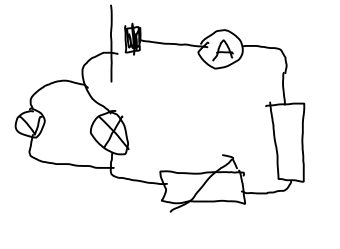
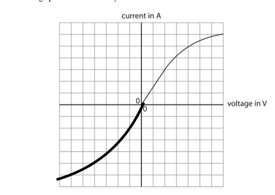

# Physics Hwk
I couldn't see any numbering scheme, so here is a list of answers in order.

* P = IV
* P = IV, I = P/V, = 110/230, = 11/23A or 0.478A
* The cables in the clothes iron cable are thicker as they need to carry more current.
* E for Electricity.
* Normally, lamps are covered in a layer of plastic which cannot conduct electricity so even if it is touched and the live wire has disconnected, the person should be fine.
* P = IVt, = 0.17 x 230 x 55 x 60, = 129,030 J
* 
* V = IR
* 1.5A. V = IR, R = V/I, = 6 / 1.5, = 4
* 
